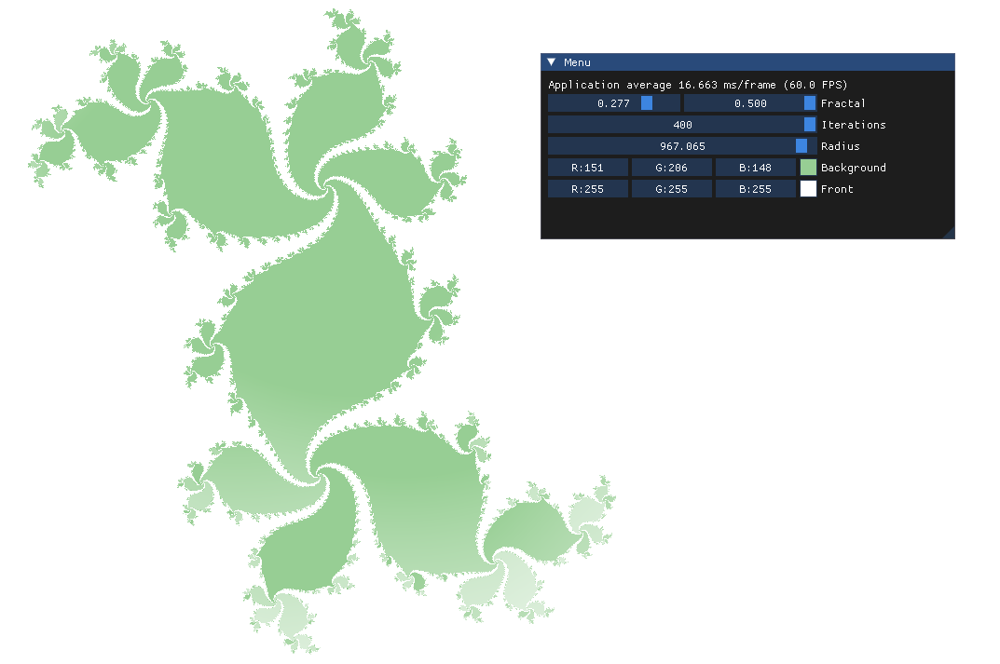
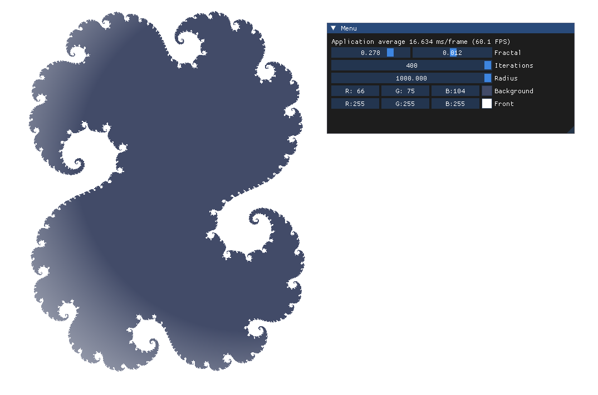

# Julia Visualizer

**julia-visualizer** is a graphical application designed to visualize Julia sets in real-time using OpenGL. It leverages OpenGL 3.3 for rendering and provides an interactive GUI powered by **Dear ImGui**, along with **GLFW** for window and input management, and **GLAD** for loading OpenGL functions. The project uses **Conan** for dependency management, ensuring a reproducible and manageable build environment.

## Features

- Real-time rendering of Julia sets using OpenGL 3.3
- Interactive GUI built with Dear ImGui
- Cross-platform window and input handling with GLFW
- Modern C++ development practices with Conan for package management

## Screenshots

Here are some example views of the application in action:

### Julia Set Visualization with GUI Controls

### Dynamic Parameter Tweaking

## Building and Installing

See the cmake and conan build guide

## License

This project is licensed under the terms described in the [LICENSE](./LICENSE) file.
